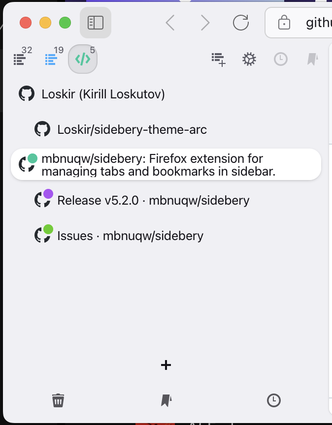
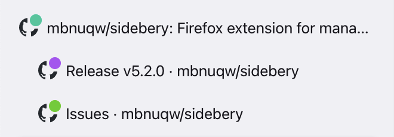
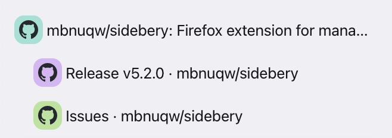

# Arc-like theme for Sidebery

## Features

- Arc-like style for tabs.
- Multi-line tab titles
- 3 styles for tab colors:
    - Dot over the favicon
    
    - Behind the favicon
    
    - Around the favicon
    
- Extra variable for side margins (`--side-margin`)

## Usage

Copy-paste the .css file into Sidebery settings → Styles editor.

Comment/uncomment code blocks to enable/disable features.
